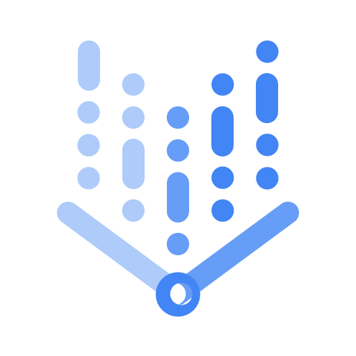

  <h1>👋 Hi, I'm Antoine Montagne</h1>
  
Data Scientist | DevOps | GCP Practitioner

  
  &nbsp;
  
  &nbsp;
  

---

I’m a Data Scientist with strong foundations in Machine Learning and DevOps, built through nearly two years in data consulting and a specialized engineering background. I enjoy building end-to-end ML systems from data preprocessing to cloud deployment.

---

## 🔧 Tech Stack

### Python & Machine Learning

  
  
  
  
  
  
  
  
  
  

### DevOps & CI/CD

  
  
  
  

### Data Engineering

  
  
  
  
  
  

### Google Cloud Platform (GCP)

  
  
  
  

### Other Tools & Languages

  
  
  
  

---

## 📌 Featured Projects

### 🔹 Twitter Disinformation Analysis
> Developed a system to detect information manipulation in tweets. Built an NLP pipeline with RoBERTa fine-tuning to extract metadata such as sentiment scores and early disinformation indicators. Dockerized for scalable deployment and Kafka for high-volume data streaming. Visualized in real-time via Kibana.

**Tech:** Python, Docker, Kafka, Hugging Face  
**Repo:** [GitHub](https://github.com/antoinemontagne/KafkaFilRouge)

---

